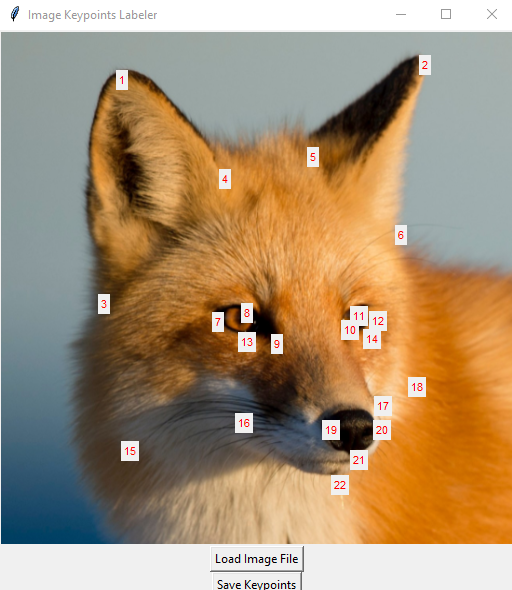
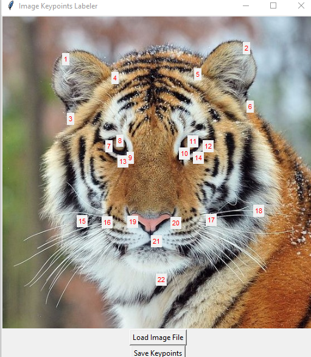
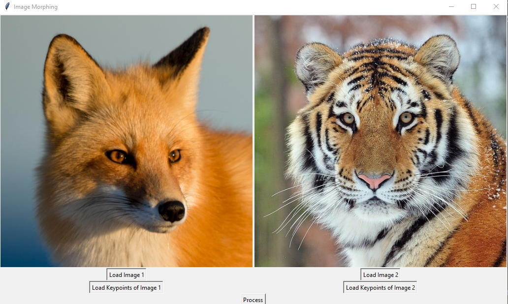
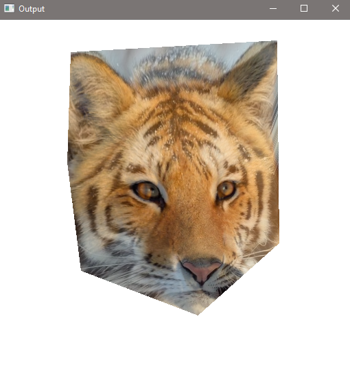

First, prepare two pictures.

Then, run **keypoints_labler_GUI.py** to manually add key-points for both pictures. Ensure the order of key-points are consistent for both images! Once labeled, save the key-points as two files. For instance:

Finally, run **morphing_GUI.py** to load both images and corresponding key-point files. Click **Process** to get the morphed image.

### This is our result:

