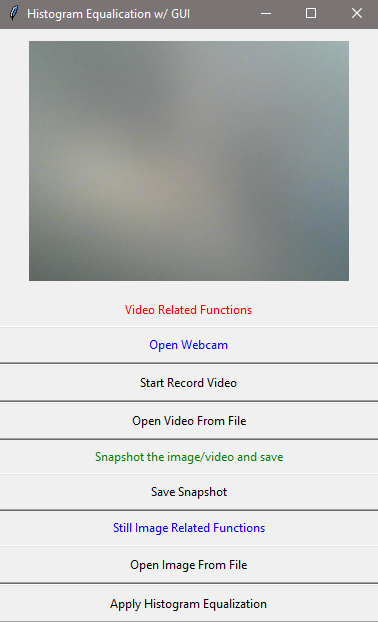

# Histogram Equalization Algorithm

Python 3 implementation

---

### GUI

> To run the program, use the following command in terminal:
>
> **Linux**
>
> ~~~ bash
> python3 main.py
> ~~~
>
> **Windows 10**
>
> ~~~ bash
> py main.py
> ~~~

Screenshot:

